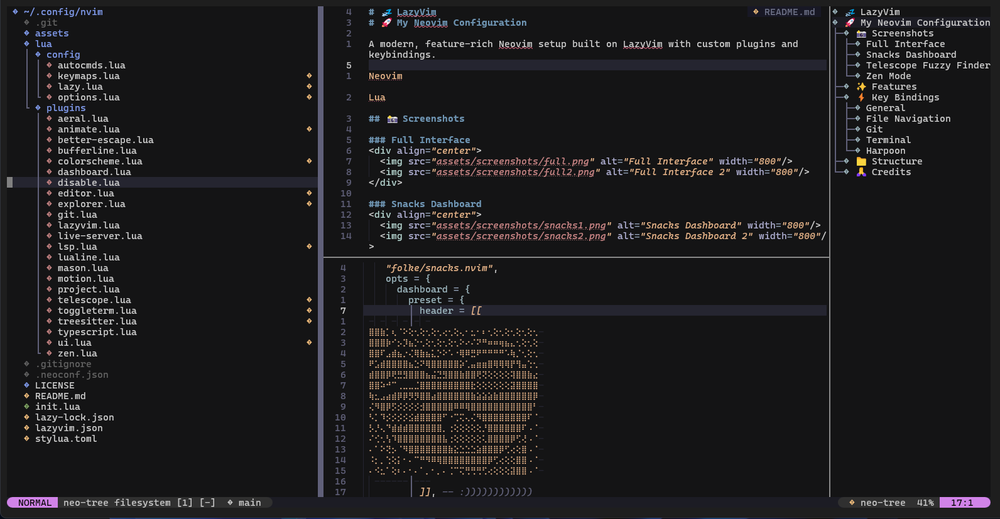
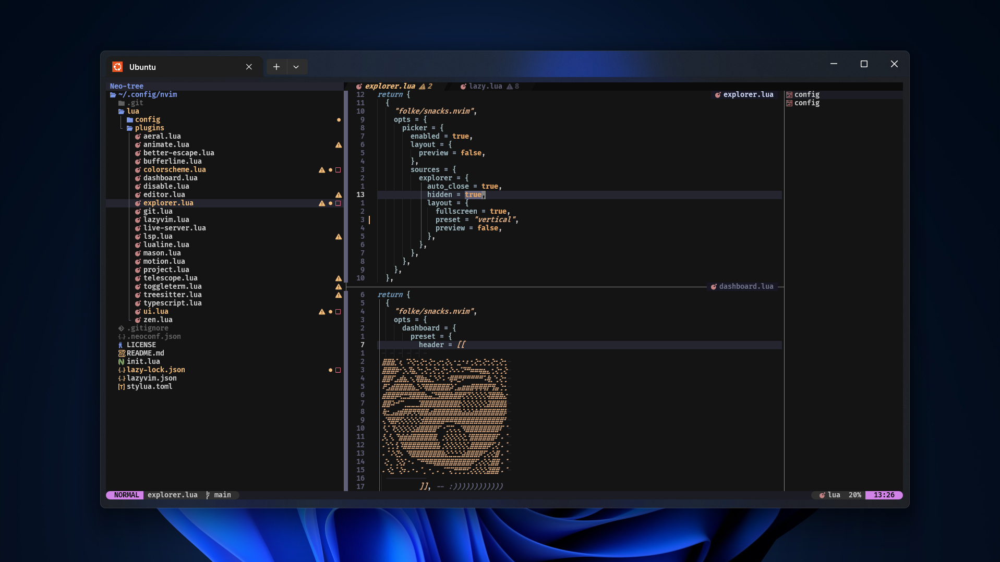
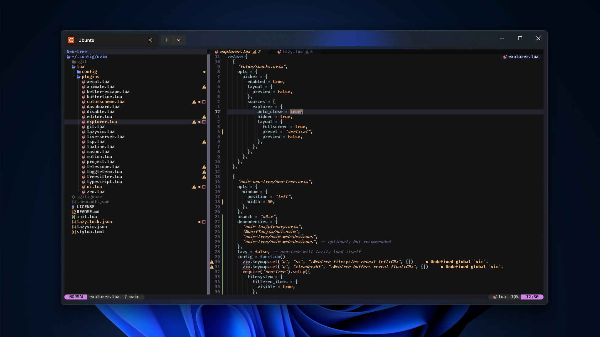
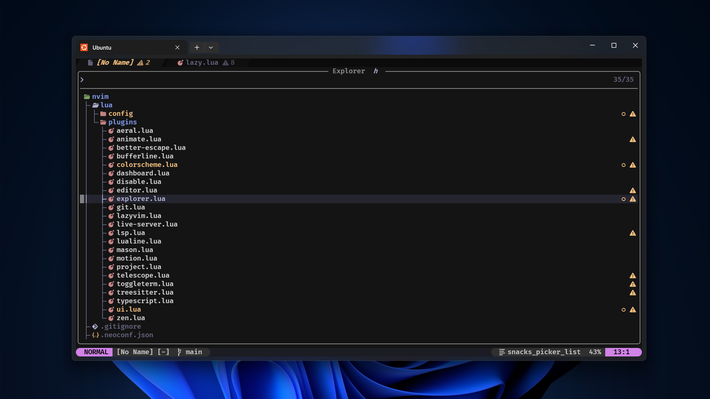
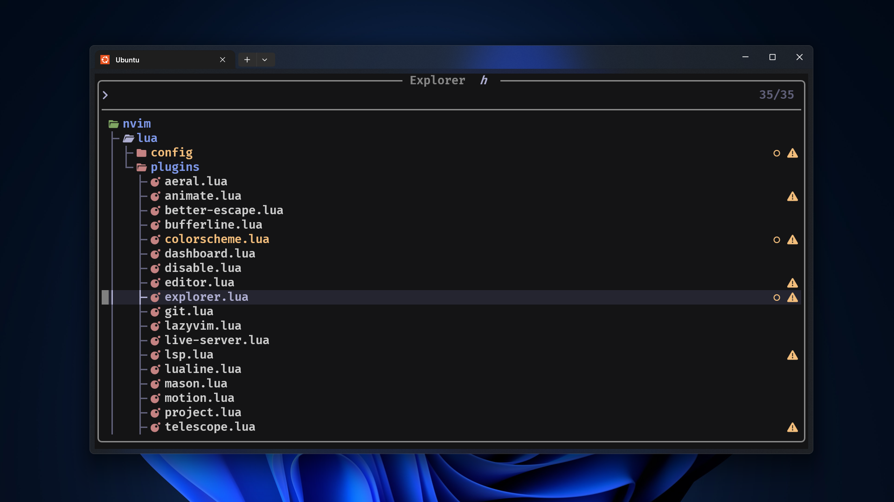
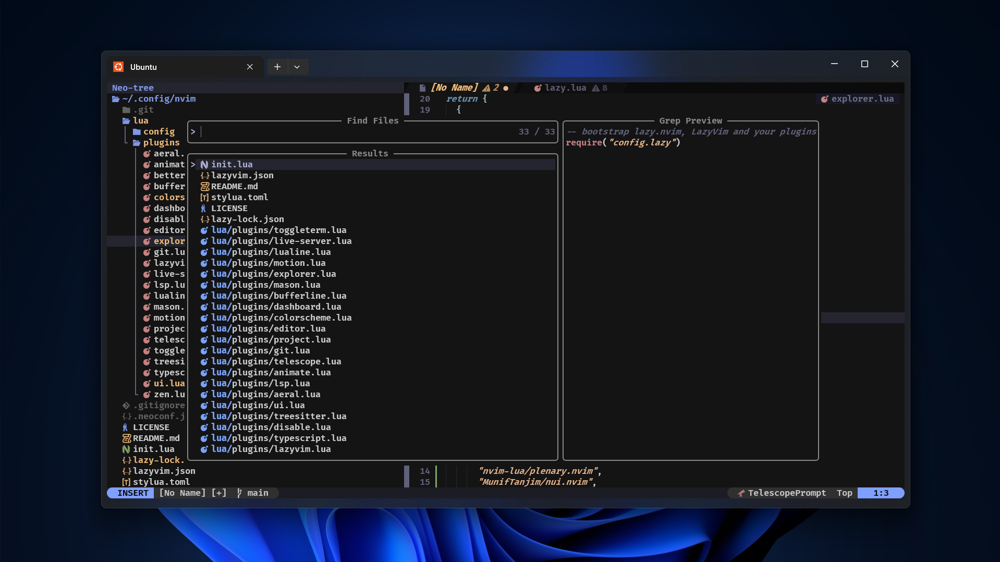
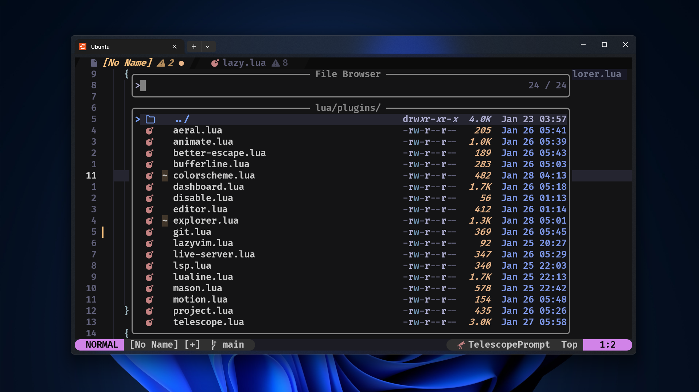
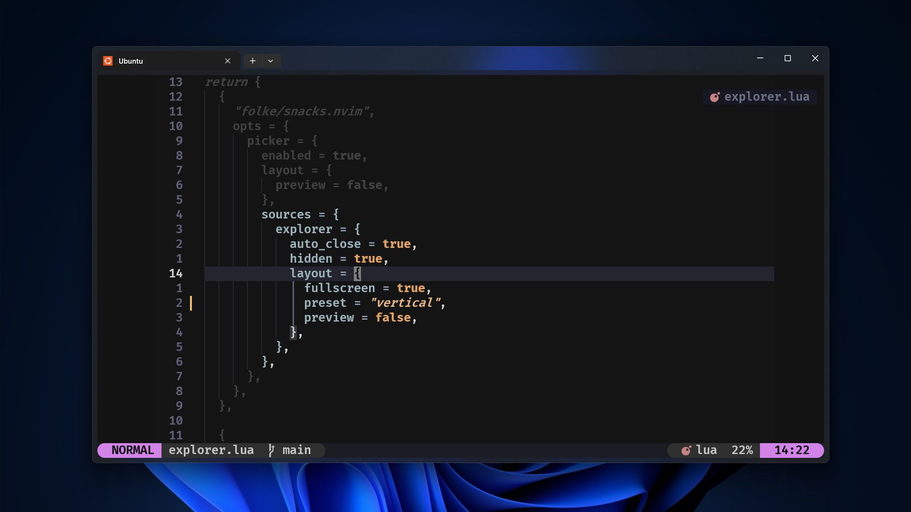

# 💤 LazyVim
# 🚀 My Neovim Configuration

A modern, feature-rich Neovim setup built on LazyVim with custom plugins and keybindings.


## 📸 Screenshots
<div align="center">
  
</div>

### Full Interface
<div align="center">
  
  
</div>

### Snacks Dashboard
<div align="center">
  
  
</div>

### Telescope Fuzzy Finder
<div align="center">
  
  
</div>

### Zen Mode
<div align="center">
  
</div>

## ✨ Features

- 🎨 **Beautiful UI** - Custom dashboard with Doge ASCII art, smooth animations, and modern design
- 📁 **File Explorer** - Neo-tree with custom icons and Git integration
- 🔍 **Fuzzy Finding** - Telescope for files, text, and more
- 💻 **Terminal** - Integrated floating terminal with toggleterm
- 🌳 **Git Integration** - Gitsigns, Neogit, and Diffview for seamless Git workflow
- 🎯 **Navigation** - Flash, Harpoon for lightning-fast movement
- 📊 **Code Navigation** - Aerial for symbol overview
- 🧘 **Focus Mode** - Zen Mode with Twilight for distraction-free coding
- 🎨 **Colorscheme** - Vague theme with custom purple accents
- 📝 **LSP** - Full language server support with Mason
- 🔧 **Auto-completion** - nvim-cmp with multiple sources
- 🌈 **Syntax Highlighting** - TreeSitter for better code understanding

## ⚡ Key Bindings

### General
| Key | Mode | Action |
|-----|------|--------|
| `jk` / `jj` | Insert | Exit insert mode |
| `<leader>z` | Normal | Toggle Zen Mode |

### File Navigation
| Key | Mode | Action |
|-----|------|--------|
| `<leader>sf` | Normal | Find files |
| `<leader>e` | Normal | Toggle file explorer |
| `<leader>a` | Normal | Toggle symbols outline |
| `s` | Normal/Visual | Flash jump |

### Git
| Key | Mode | Action |
|-----|------|--------|
| `<leader>gg` | Normal | Open Neogit |
| `<leader>gd` | Normal | Open DiffView |
| `<leader>gh` | Normal | Git file history |

### Terminal
| Key | Mode | Action |
|-----|------|--------|
| `<C-\>` | Normal/Terminal | Toggle terminal |
| `<leader>tf` | Normal | Floating terminal |
| `<leader>th` | Normal | Horizontal terminal |
| `<leader>tv` | Normal | Vertical terminal |
| `jk` | Terminal | Exit terminal mode |

### Harpoon
| Key | Mode | Action |
|-----|------|--------|
| `<leader>ha` | Normal | Add file to harpoon |
| `<C-e>` | Normal | Toggle harpoon menu |
| `<C-h>` | Normal | Go to harpoon file 1 |
| `<C-j>` | Normal | Go to harpoon file 2 |
| `<C-k>` | Normal | Go to harpoon file 3 |
| `<C-l>` | Normal | Go to harpoon file 4 |

 ## 📁 Structure
```
~/.config/nvim/
├── lua/
│   ├── config/
│   │   ├── autocmds.lua      # Auto commands
│   │   ├── keymaps.lua       # Key mappings
│   │   └── options.lua       # Vim options
│   └── plugins/
│       ├── aerial.lua        # Code outline
│       ├── better-escape.lua # Fast escape
│       ├── bufferline.lua    # Tab line
│       ├── coding.lua        # Coding utilities
│       ├── colorscheme.lua   # Theme
│       ├── dashboard.lua     # Start screen
│       ├── disable.lua       # Disabled plugins
│       ├── editor.lua        # Editor enhancements
│       ├── explorer.lua      # File explorer
│       ├── git.lua           # Git integration
│       ├──kulala.lua         # HTTP client
│       ├── lazyvim.lua       # LazyVim config
│       ├── live-server.lua   # Live server
│       ├── lsp.lua           # LSP config
│       ├── lualine.lua       # Status line
│       ├── mason.lua         # LSP installer
│       ├── motion.lua        # Navigation plugins
│       ├── project.lua       # Project management
│       ├── telescope.lua     # Fuzzy finder
│       ├── todo-comments.lua # TODO highlighting
│       ├── toggleterm.lua    # Terminal
│       ├── treesitter.lua    # Syntax highlighting
│       ├── typescript.lua    # TypeScript support
│       ├── ui.lua            # UI enhancements
│       └── zen-mode.lua      # Focus mode
└── init.lua


### Install

1. **Backup existing config:**
```bash
mv ~/.config/nvim ~/.config/nvim.bak
mv ~/.local/share/nvim ~/.local/share/nvim.bak
```

2. **Clone this config:**
```bash
git clone https://github.com/YOUR_USERNAME/nvim-config.git ~/.config/nvim
```

3. **Start Neovim:**
```bash
nvim
```

## 🙏 Credits

- [LazyVim](https://github.com/LazyVim/LazyVim) - Base configuration
- [folke](https://github.com/folke) - Amazing plugins
- All plugin authors

---

A starter template for [LazyVim](https://github.com/LazyVim/LazyVim).
Refer to the [documentation](https://lazyvim.github.io/installation) to get started.


**Much Vim. Very Edit. Wow.** 🐕
